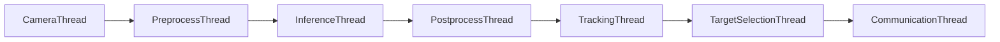

# LWIR DEEPX 표적 탐지·추적 시스템

LWIR 영상에서 객체를 탐지하고 Track ID를 부여합니다. 사용자가 ID를 선택하면 그 객체의 위치를 STM32에 전달해 짐벌이 따라가도록 만드는 프로젝트입니다. 현재는 PC의 `runtime-pc` 환경에서 **YOLO + ByteTrack 기준선**의 C++ 구조를 개발 중입니다.

## 파이프라인 구조



각 상자는 별도 POSIX pthread입니다. thread 사이 데이터는 `ThreadSafeQueue`로 전달되며, [Application](src/app/application.cpp)이 구성요소와 thread를 연결하고 `Tracker` 객체를 소유합니다. `TrackingThread`는 `Tracker` 인터페이스를 통해 현재 `ByteTrackTracker`를 호출합니다.

| 전달 단계 | 데이터 타입 | 담는 내용 |
|---|---|---|
| Camera → Preprocess | `Frame` | 프레임 ID, 획득 시각, 영상 |
| Preprocess → Inference | `ModelInput` | 프레임 ID, 모델 입력 |
| Inference → Postprocess | `ModelOutput` | 프레임 ID, 모델 출력 |
| Postprocess → Tracking | `DetectionResult` | 프레임 ID, `vector<Detection>` |
| Tracking → Target selection | `TrackingResult` | 프레임 ID, `vector<Track>` |
| Target selection → Communication | `TargetSelection` | 선택 ID와 일치한 Track, 또는 일치 결과 없음 |

`Detection`과 `Track`은 객체 하나를 뜻합니다. `DetectionResult`와 `TrackingResult`는 객체가 0개인 프레임도 표시할 수 있는 **한 프레임의 결과**입니다. 일반 실행과 측정 실행은 같은 데이터 타입을 사용합니다.

## 현재 기준선과 설정

현재 브랜치의 실행 조합은 **YOLOv8 + ByteTrack**입니다. 코드나 파이프라인 연결이 달라지는 조합은 별도 브랜치에서 개발하고, 같은 구현 안에서 바꿀 모델 파일·입력 조건·임계값·측정 모드는 YAML로 관리합니다. 브랜치에서 개발한 기능이 실제 코드에 연결되기 전에는 YAML 값만 바꿔 실행할 수 없습니다.

- [runtime.yaml](config/runtime.yaml): 실행 조합, 로그 레벨, 측정 모드와 각 구성요소 설정 파일 경로. 현재 Factory가 생성할 수 있는 것은 YOLOv8 CPU 전처리·후처리와 ByteTrack입니다.
- [yolov8n.yaml](config/model/yolov8n.yaml): 모델 경로 `models/yolov8n.dxnn`, 입력 크기·전처리 조건·후처리 임계값.
- [bytetrack.yaml](config/tracking/bytetrack.yaml): 추적 파라미터. 현재 ByteTrack 구현은 파일 경로만 보관하며 값을 적용하지 않습니다.

컴파일된 `.dxnn`은 `models/`에 두도록 경로가 잡혀 있지만, 현재 모델 파일은 없고 `models/`는 Git에서 제외됩니다. `runtime.yaml`의 `communication.enabled`는 아직 통신 thread를 끄지 않습니다.

## Docker 환경과 사용 방법

`runtime-pc`는 팀원이 같은 Linux 빌드 환경에서 C++ runtime을 개발하기 위한 컨테이너입니다. 소스는 호스트 저장소를 컨테이너에 연결하고, 빌드 결과는 Docker 볼륨 `runtime-build`에 보관합니다. `compiler-dx`는 모델 컴파일용, `runtime-opi`는 향후 Orange Pi 실행용 환경을 둘 위치입니다. 현재 `docker/runtime-opi/`는 자리만 준비되어 있고, Compose에는 `runtime-pc`만 정의되어 있습니다.

### 0. 실행 환경과 저장소 준비

아래의 `git`·`./docker_build.sh`·`docker` 명령은 **Ubuntu 셸**에서 실행합니다. Windows에서는 Docker Desktop의 Linux 컨테이너 엔진과 별도의 WSL 2 Ubuntu 배포판을 준비하고, Docker Desktop **Settings → Resources → WSL Integration**에서 해당 Ubuntu 배포판의 연동을 켭니다. `docker-desktop`은 Docker 내부 배포판이며 작업용 Ubuntu 셸이 아닙니다. WSL 배포판이 없다면 Windows PowerShell에서 `wsl --install -d Ubuntu-22.04`로 설치할 수 있습니다. [Microsoft WSL 설치 안내](https://learn.microsoft.com/windows/wsl/install), [Docker Desktop WSL 연동 안내](https://docs.docker.com/desktop/features/wsl/)

WSL Ubuntu에서는 Windows 경로 `/mnt/c/...` 대신 Ubuntu 홈 디렉터리에서 소스를 받습니다. Docker Desktop이 실행 중인 상태에서 Ubuntu 셸의 `docker version`과 `docker compose version`이 성공해야 합니다. 이미지의 Ubuntu 22.04는 컨테이너 내부 버전으로, WSL 배포판 버전과 별개입니다.

새 WSL 사용자에게 `docker version`이 `/var/run/docker.sock` 접근 거부를 표시할 수 있습니다. 소켓이 `root:docker` 소유이고 사용자가 `docker` 그룹에 없다면, Ubuntu 셸에서 다음 명령을 한 줄씩 실행합니다. `docker` 그룹은 Docker 엔진에 대한 높은 권한을 부여합니다. [Docker의 사용자 권한 안내](https://docs.docker.com/engine/install/linux-postinstall/)

```bash
sudo usermod -aG docker "$USER"
newgrp docker
docker version
```

처음 받는 경우 Ubuntu 셸에서 두 저장소를 같은 상위 디렉터리에 둡니다. 이미 프로젝트 저장소를 clone했다면 `git clone`은 반복하지 말고 그 저장소 루트에서 아래의 브랜치 확인 단계부터 시작합니다.

```bash
mkdir -p ~/lwir-work
cd ~/lwir-work
git clone https://github.com/lwir-deepx-tracking-system/runtime.git
cd runtime
```

처음 clone하면 기본 브랜치 하나만 로컬에 만들어집니다. `git branch -a`로 GitHub에서 가져온 `remotes/origin/...` 브랜치까지 확인합니다. **팀에서 정한 작업 기준 브랜치가 원격에만 있다면**, 그 이름을 입력하고 처음 한 번 `--track`으로 연결합니다.

```bash
git fetch origin
git branch -a
read -r -p '팀 기준 브랜치 이름: ' base_branch
git switch --track "origin/$base_branch"
git branch -vv
```

`--track`은 원격 브랜치에서 같은 이름의 로컬 브랜치를 만들고 둘을 연결합니다. `git branch -vv`의 현재 브랜치 옆에 `[origin/브랜치명]`이 표시되면 연결된 것입니다. 이 연결로 `git pull`과 `git push`의 기본 상대가 정해지지만 자동으로 동기화되지는 않습니다. **이미 로컬에 있는 브랜치라면** `--track`을 반복하지 말고 `git switch` 뒤에 그 브랜치 이름을 적어 전환합니다. 이 프로젝트 저장소의 브랜치 작업은 WSL Ubuntu 셸에서 진행하며, 아래 DX-AllSuite의 고정 커밋 체크아웃과는 별개입니다.

### 1. DEEPX 기반 이미지 준비

`runtime-pc/Dockerfile`은 고정된 DEEPX 기반 이미지 태그 `dx-runtime:dxas-5749ab70-ubuntu22.04`를 사용합니다. 팀의 DX-AllSuite 소스 버전은 **커밋 `5749ab70cc75cede356c57b9cc7cf91229e47742`**로 고정합니다. 처음 환경을 만드는 PC에서는 [DEEPX DX-AllSuite 설치 안내](https://github.com/DEEPX-AI/dx-all-suite/blob/main/docs/source/02_Setting_Up_Environment.md)에 따라 저장소를 받은 뒤, 아래 순서로 해당 커밋과 하위 모듈을 맞춰 빌드합니다.

```bash
cd ..
git clone https://github.com/DEEPX-AI/dx-all-suite.git
cd dx-all-suite
git checkout 5749ab70cc75cede356c57b9cc7cf91229e47742
git submodule update --init --recursive
./docker_build.sh --target=dx-runtime --ubuntu_version=22.04
docker tag dx-runtime:ubuntu-22.04 dx-runtime:dxas-5749ab70-ubuntu22.04
docker image inspect dx-runtime:dxas-5749ab70-ubuntu22.04
cd ../runtime
```

이미 **고정 태그의 기반 이미지**가 있으면 이 단계를 건너뜁니다. 빌드 스크립트는 DX-AllSuite의 하위 모듈과 의존 파일을 사용하는 Bash 스크립트입니다. Ubuntu 호스트에서는 준비된 기반 이미지로 프로젝트 이미지를 빌드·실행했습니다. Windows에서는 Docker Desktop과 WSL 2 Ubuntu 환경에서 DX-AllSuite 기반 이미지 빌드부터 컨테이너 안의 CMake 빌드·실행까지 확인했습니다.

### 2. 프로젝트 이미지 준비

이 저장소의 `compose.yaml`에는 `image: lwir-runtime-pc:dxas-5749ab70-ubuntu22.04`만 있고 자동 이미지 빌드 설정은 없습니다. 이 이미지가 없으면 **이 저장소 루트**에서 같은 태그로 빌드합니다.

```bash
docker build -t lwir-runtime-pc:dxas-5749ab70-ubuntu22.04 -f docker/runtime-pc/Dockerfile .
```

### 3. Docker 컨테이너 열기

저장소 루트에서 실행합니다.

```bash
docker compose run --rm runtime-pc
```

컨테이너의 작업 디렉터리는 `/workspace/lwir-deepx-tracking-system`입니다.

### 4. 컨테이너 안에서 빌드

```bash
cmake -S . -B build
cmake --build build
```

### 5. 컨테이너 안에서 실행

```bash
./build/lwir_runtime
```

실행 파일은 현재 작업 디렉터리의 `config/runtime.yaml`을 읽습니다. 현재 Camera는 실제 영상을 읽지 않아 `open()`이 실패하고 각 thread가 종료됩니다. 따라서 이 실행은 thread 연결·종료 흐름 확인용입니다.

### 6. 이후 개발할 때 (Windows + WSL)

0~5단계를 한 번 완료했다면, 평소에는 저장소 복제와 DX-AllSuite 기반 이미지 빌드를 반복하지 않습니다. **Git, Docker, CMake 작업의 시작점은 WSL Ubuntu**로 통일합니다. PowerShell은 WSL 설치 등 Windows 설정이 필요할 때만 사용합니다.

1. Windows에서 Docker Desktop을 실행하고 엔진이 시작될 때까지 기다립니다. Windows 시작 메뉴에서 **Ubuntu 22.04**를 열어 `user@...$` 프롬프트로 들어갑니다. 듀얼부팅의 Ubuntu로 재부팅할 필요는 없습니다.
2. Windows에 VS Code와 Microsoft의 [WSL 확장](https://code.visualstudio.com/docs/remote/wsl)을 한 번 설치합니다. Ubuntu 셸에서 프로젝트를 엽니다.

   ```bash
   cd ~/lwir-work/runtime
   code .
   ```

   VS Code 왼쪽 아래에 `WSL: Ubuntu-22.04`가 표시되는지 확인합니다. 이후 **Terminal → New Terminal**을 열면 WSL 터미널이 열립니다. 터미널의 현재 위치가 `/home/<사용자명>/lwir-work/runtime`인지 `pwd`로 확인할 수 있습니다. 저장소는 Windows의 `C:\...`가 아니라 WSL의 `/home/...`에 있습니다.
3. **새 작업을 시작할 때** VS Code의 WSL 터미널에서 팀 기준 브랜치를 최신 상태로 맞춘 다음 자기 작업 브랜치를 만듭니다. 아래 `read` 명령이 이름을 물으면 팀에서 정한 기준 브랜치와 자신의 새 작업 이름(예: `feature/camera-input`)을 입력합니다. 이 명령은 `user@...$`인 WSL 터미널에서 실행합니다.

   ```bash
   read -r -p '팀 기준 브랜치 이름: ' base_branch
   git switch "$base_branch"
   git pull --ff-only
   read -r -p '새 작업 브랜치 이름: ' work_branch
   git switch -c "$work_branch"
   git branch --show-current
   ```

   `git pull --ff-only`는 원격의 새 커밋을 받아 **기록이 갈라지지 않았을 때만** 기준 브랜치를 앞으로 이동시킵니다. 기록이 갈라졌다면 자동으로 합치지 않고 멈추므로 팀과 변경 사항을 확인합니다. 마지막 명령에 자기 작업 브랜치 이름이 나오는지 확인합니다. 같은 작업을 다음 날 이어 한다면 `git branch`로 이름을 확인하고 `git switch` 뒤에 그 이름을 적어 돌아갑니다. 작업이 끝나면 자기 브랜치를 GitHub에 올리고, PR의 대상은 팀에서 정한 기준 브랜치로 지정합니다.
4. VS Code에서 코드를 수정합니다. WSL 터미널의 **프로젝트 저장소 루트**에서 컨테이너를 엽니다.

   ```bash
   docker compose run --rm runtime-pc
   ```

   `root@...:/workspace/lwir-deepx-tracking-system#`처럼 프롬프트가 바뀌면 컨테이너 안입니다. 여기에서 빌드하고 실행합니다.

   ```bash
   cmake -S . -B build
   cmake --build build
   ./build/lwir_runtime
   ```

5. 코드를 다시 수정했다면 열려 있는 컨테이너에서 위 CMake 빌드·실행 명령을 다시 실행합니다. 소스는 컨테이너에 연결되어 수정 내용이 바로 보이고, `runtime-build` 볼륨에 빌드 결과가 남습니다. 작업을 마치면 컨테이너에서 `exit`을 입력해 WSL 터미널로 돌아갑니다.

**이미지를 다시 빌드해야 하는 경우:** C++ 소스나 설정 YAML만 바꿨다면 `docker build`는 필요하지 않습니다. `docker/runtime-pc/Dockerfile` 또는 그 안에서 설치하는 패키지를 바꿨다면 프로젝트 저장소 루트의 WSL 터미널에서 2단계 `docker build` 명령을 다시 실행합니다. DEEPX 기반 이미지 버전을 바꿨거나 해당 이미지가 삭제됐다면 1단계부터 다시 실행합니다. Windows 재부팅이나 컨테이너의 `exit`만으로 이미지를 다시 빌드할 필요는 없습니다.

### 호스트 OS와 DEEPX 상태

- **Ubuntu:** Docker Engine과 Compose가 있으면 위 방식으로 Linux 컨테이너를 사용할 수 있습니다. 이 저장소의 빌드·실행 명령은 Ubuntu 호스트에서 확인했습니다. [Docker의 Ubuntu 설치 문서](https://docs.docker.com/engine/install/ubuntu/)
- **Windows:** 위 Bash 절차는 WSL 2 Ubuntu 배포판과 Docker Desktop의 WSL 연동을 전제로 합니다. PowerShell에서 `./docker_build.sh`를 그대로 실행할 수 없습니다. Windows 호스트에서 WSL 2 Ubuntu 22.04와 Docker Desktop을 사용해 위 절차를 실행했습니다. 현재 이미지는 `linux/amd64`입니다. [Docker Desktop의 Windows 설치 문서](https://docs.docker.com/desktop/setup/install/windows-install/)
- **DEEPX:** 현재 `runtime-pc` 이미지에서 DX-RT C++ API의 컴파일·링크·버전 조회를 확인했습니다. DX-RT는 기반 `dx-runtime` 이미지에서 상속합니다. **현재 프로젝트 CMake는 DX-RT를 링크하지 않고, `Inference`도 NPU 호출을 하지 않습니다.** `compose.yaml`에도 NPU 장치 전달 설정이 없어 실제 하드웨어 실행은 확인되지 않았습니다.

### 측정 모드

[runtime.yaml](config/runtime.yaml)의 `measurement.enabled`를 `true`로 설정하면 각 worker가 프레임별 큐 대기 시간과 처리 시간을 기록합니다. Tracking과 Communication 행의 `e2e_ms`는 카메라 획득 완료부터 각각 추적 완료, `STM32Link::send()` 반환까지의 지연입니다. 현재 `send()`는 빈 구현이므로 Communication 값은 실제 STM32 전송 지연을 뜻하지 않습니다. 종료 후 `results/<모델명>_<시각>/`에 `metrics.csv`와 참조한 YAML의 사본을 저장합니다. 프로그램은 원본 YAML을 실행 중 수정하지 않습니다. 별도 측정 thread는 없으며, 기록은 stage당 최대 10,000건입니다. 현재 Camera가 프레임을 반환하지 않으므로 CSV에는 헤더만 생성됩니다.

`results/`는 Git에서 제외됩니다. 측정 모드의 CSV는 **통합 실행 결과**이며, 컴포넌트 단독 테스트의 측정값은 현재 자동 저장하지 않습니다.

## 컴포넌트 테스트 예시

[tests](tests)에는 구성요소별 작업 위치와 두 가지 예시가 있습니다. [TargetSelector 테스트](tests/target/test_target_selector.cpp)는 선택 ID의 동작을 검사하는 코드입니다. [ByteTrack 테스트](tests/tracking/test_bytetrack.cpp)는 아직 구현 전 골격이며, [프레임 목록](tests/tracking/data/frames.csv)과 [검출 예시](tests/tracking/data/detections.csv)를 넣어 두었습니다. `Detection` 필드와 ByteTrack 로직이 완성되면 CSV를 읽어 프레임 순서대로 `track()`을 호출하도록 채워야 합니다. 검출이 없는 4번 프레임도 빈 목록으로 호출해야 합니다.

현재 테스트 대상은 [CMakeLists.txt](CMakeLists.txt)에서 모두 주석 처리되어 있으므로 `ctest`로 실행되지 않습니다. 각 담당자가 자기 컴포넌트를 직접 호출해 동작을 검증하고, 단독 처리 시간이 필요하면 해당 호출 구간을 측정합니다. 통합 실행의 큐 대기·전체 지연은 위 측정 모드에서 확인합니다.

## 구현할 내용과 수정 위치

| 담당 단계 | 주요 파일 | 구현할 내용 |
|---|---|---|
| Camera | `src/camera/camera.cpp`, `include/common/frame.hpp` | LWIR 프레임 획득, 이미지 형식과 버퍼 수명 확인 |
| Preprocess | `src/preprocess/yolov8_preprocessor.cpp`, `include/common/model_input.hpp` | 모델 YAML에 맞는 영상 변환과 입력 텐서 구성 |
| Inference | `src/inference/inference.cpp`, `include/common/model_output.hpp` | DX-RT 모델 로드·실행, 출력 텐서와 소유권 정의 |
| Postprocess | `src/postprocess/yolov8_postprocessor.cpp`, `include/common/detection.hpp` | YOLO 출력 해석, 점수 필터와 NMS, Detection 생성 |
| Tracking | `src/tracking/bytetrack_tracker.cpp`, `include/common/track.hpp` | ByteTrack 상태·ID 관리, Track 생성, 설정 적용 |
| 대상 선택 | `src/target/target_selector.cpp`, `src/pipeline/target_selection_thread.cpp` | GUI 선택 ID를 현재 Track 목록에 적용하는 흐름 확인 |
| STM32 통신 | `src/communication/stm32_link.cpp`, `src/pipeline/communication_thread.cpp` | 전송 형식과 연결, 대상 없음 상태 처리 |

각 담당자는 자기 단계의 **입력 타입 → 처리 함수 → 출력 타입**을 먼저 확인하면 됩니다. `src/pipeline/*_thread.cpp`는 queue와 worker 실행 흐름을 담당합니다. 새 소스 파일을 추가하면 `CMakeLists.txt`의 빌드 대상도 확인해야 합니다.

표는 수정 파일의 전체 목록이 아닙니다. 데이터 타입이 바뀌면 `include/common/`과 관련 pipeline thread도, YAML 선택지가 늘어나면 `src/app/app_config.cpp`와 `src/factory/component_factory.cpp`도 확인해야 합니다. 새 라이브러리가 필요하면 CMake와 Dockerfile에 함께 반영합니다.

## 현재 구현 범위와 실험 방향

thread·queue 연결, 프레임 ID 전달, 대상 선택 경계, 측정 모드 저장 구조는 마련되어 있고 `runtime-pc`에서 컴파일·링크가 됩니다. 현재 활성 설정은 YOLOv8 + ByteTrack 기준선이며, 모델 경로·전처리 조건·후처리 임계값은 YAML에서 관리합니다. 실제 Camera·YOLO 추론·후처리·ByteTrack·STM32 전송은 아직 골격이고 GUI 입력도 연결되지 않았습니다. DINO·KLT와 PPU 후처리는 현재 실행 설정에 연결되어 있지 않습니다.

첫 공동 목표는 **동일한 LWIR 입력에서 YOLO 검출과 ByteTrack ID가 끝까지 전달되는 기준선**을 만드는 것입니다. 이후 모델과 처리 방식을 바꿔 성능을 비교합니다. queue 적체 정책과 측정 범위 등 팀이 합의할 항목은 [discussion.md](discussion.md)에 정리되어 있습니다.
