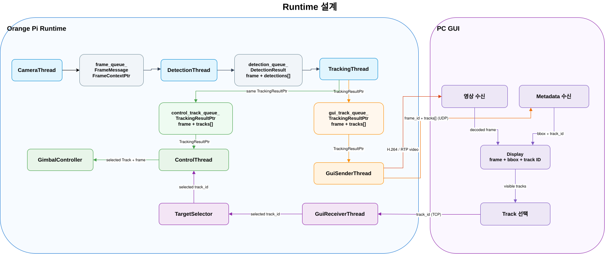

# LWIR DEEPX Tracking Runtime

LWIR 카메라 영상에서 객체를 검출하고 추적한 뒤, 같은 프레임과 Track 결과를 GUI와 짐벌 제어 경로로 전달하는 C++ 런타임입니다.

현재 기준 조합은 다음과 같습니다.

- 입력: `CV_16UC1` LWIR 영상
- Detection: YOLOv8 + DEEPX `dx_app` 구조
- Tracking: ByteTrack
- 실행 구조: POSIX pthread + `ThreadSafeQueue`
- 동기화/통신: POSIX pthread mutex와 POSIX socket API

worker thread와 queue 동기화, socket은 POSIX API를 사용합니다. 프레임과 처리 결과는
`shared_ptr`로 전달하고, 종료 및 실패 상태는 atomic flag로 관리합니다. GStreamer는
영상 pipeline 내부 구현을 위해 GLib을 사용하지만 애플리케이션 worker와 socket의
소유권은 POSIX 경계에 유지합니다.

## 파이프라인



Camera에서 만든 `FrameContext`는 복사하지 않고 `shared_ptr`로 Detection, Tracking, GUI까지 전달합니다. 따라서 GUI는 Track 결과가 생성된 정확한 원본 프레임을 사용할 수 있습니다.

Detection은 `DxAppDetectionPipeline` 한 객체가 전처리, 추론, 후처리를 소유합니다. 별도의 preprocess/inference/postprocess thread는 사용하지 않습니다.

## Applications

### Runtime

실시간 Camera → Detection → Tracking → Target Selection → Control / GUI 전체 파이프라인을 실행합니다.
`gui.enabled`와 `control.enabled` 조합에 따라 실행 결과를 자동으로 구분합니다.

| 구분 | GUI | Control |
| --- | --- | --- |
| `core` | 비활성 | 비활성 |
| `gui` | 활성 | 비활성 |
| `full` | 활성 | 활성 |

Control은 GUI에서 선택한 Track을 사용하므로 GUI 없이 Control만 활성화하는 설정은 허용하지
않습니다. 실행 중 `Ctrl+C`를 입력하면 프레임 생산을 멈추고 queue를 순서대로 닫은 뒤 worker를
join하고 측정 결과를 저장합니다.

### Capture

LWIR 카메라 프레임을 Benchmark용 데이터셋으로 저장합니다.

### Benchmark

저장된 모든 sequence의 16-bit PNG를 순차 처리하여 Detection/Tracking prediction과 각 단계의
처리 시간을 저장합니다.

## Build & Run

```bash
# Capture
./scripts/build_capture.sh
./build/capture/lwir_capture

# Benchmark
./scripts/build_benchmark.sh
./build/benchmark/lwir_benchmark

# Runtime
./scripts/build_runtime.sh
./build/runtime/lwir_runtime

# Test
./scripts/test.sh
```

Runtime과 Benchmark는 DEEPX 환경을 사용합니다. Capture와 Runtime은 실제 LWIR
카메라 입력을 사용하며, Docker는 개발 및 테스트 환경을 구성할 때 사용할 수 있습니다.

## Dataset

Capture가 생성하는 데이터셋은 sequence 단위로 구성합니다.

```text
<dataset_root>/
├── seq_001/
│   ├── images/
│   │   ├── 000001.png
│   │   ├── 000002.png
│   │   └── ...
│   └── sequence.yaml
├── seq_002/
└── ...
```

`images/`

- TE-EV1에서 저장한 16-bit LWIR PNG frame

`sequence.yaml`

- 촬영 sequence의 조건 및 metadata
- distance, person count, motion, temperature, frame count, image resolution

## Capture → Benchmark

```text
Capture
  ↓
16-bit LWIR Images + Sequence Metadata
  ↓
Benchmark
  ↓
Detection / Tracking Predictions + Timing
```

Benchmark는 설정된 dataset root 아래의 여러 sequence를 읽습니다. Dataset root는
프로젝트 내부의 `datasets/` 또는 외부 저장장치의 `/mnt/lwir_data/datasets/`를 사용할
수 있습니다. 각 sequence는 `000001.png`부터 누락 없이 연속된 frame 이름을 사용해야 하며,
sequence가 바뀔 때마다 Tracker 상태를 초기화합니다.

## 결과 저장 구조

Benchmark 결과는 model과 tracker 조합 아래에서 실행 시각별로 저장합니다.

```text
/mnt/lwir_data/results/benchmark/
└── yolov8n_bytetrack/
    └── 20261007_190531/
        ├── benchmark.yaml
        ├── yolov8n.yaml
        ├── detections/
        ├── tracks/
        └── timing/
```

Runtime 결과는 같은 조합 아래에서 `core`, `gui`, `full` 모드와 실행 시각으로 구분합니다.

```text
/mnt/lwir_data/results/runtime/
└── yolov8n_bytetrack/
    ├── core/20261007_193015/
    ├── gui/20261007_194230/
    └── full/20261007_195105/
        ├── runtime.yaml
        ├── yolov8n.yaml
        └── metrics.csv
```

실행 디렉터리는 `YYYYMMDD_HHMMSS` 형식을 사용하며 같은 초에 충돌하면 `_1`, `_2` suffix를
붙입니다. 실행 중 오류가 발생하면 해당 timestamp 디렉터리를 삭제하여 완료된 결과만 남깁니다.

## Configuration

Runtime, Capture, Benchmark는 각각 `config/runtime.yaml`, `config/capture.yaml`,
`config/benchmark.yaml` 설정을 사용합니다. 모델 관련 설정은 `config/model/` 아래의
별도 model configuration으로 관리하며 실행 파라미터는 YAML에서 변경합니다.

- Runtime 측정 결과 root: `measurement.output_root`
- Capture dataset root와 sequence: `path.dataset_root`, `sequence.id`
- Benchmark dataset/result root: `path.dataset_root`, `path.output_root`
- Runtime/Benchmark model 설정: `model.config`

## 현재 구현 상태

- 구현됨: thread/queue 연결, shared Frame 수명 관리, LWIR 전처리, 설정 검증,
  ByteTrack, GUI/제어 결과 분기
- 구현됨: `core`/`gui`/`full` 구분, Runtime/Benchmark 결과 snapshot과 실패 시 정리,
  Runtime stage 측정, `Ctrl+C` 정상 종료
- 구현됨: GStreamer `x264enc` 기반 H.264/RTP/UDP 영상 송신, 별도 Track
  metadata UDP 송신, GUI 송신 시작 timestamp 전달, GUI TCP 명령 수신·재접속·종료 처리
- 구현됨(하드웨어 미검증): i3system Thermal Expert SDK 카메라 입력
- 골격 상태: DEEPX NPU 추론·후처리, Orange Pi 하드웨어 H.264 encoder,
  짐벌 통신

논의가 필요한 항목은 [Discussion](discussion.md)에서 확인할 수 있습니다.

## Test

```bash
./scripts/test.sh
```

필요하면 생성된 `build/test` 디렉터리에서 특정 CTest만 직접 실행할 수 있습니다.
