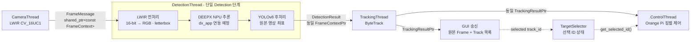

# LWIR DEEPX Tracking Runtime

LWIR 카메라 영상에서 객체를 검출하고 추적한 뒤, 같은 프레임과 Track 결과를 GUI와 짐벌 제어 경로로 전달하는 C++ 런타임입니다.

현재 기준 조합은 다음과 같습니다.

- 입력: `CV_16UC1` LWIR 영상
- Detection: YOLOv8 + DEEPX `dx_app` 구조
- Tracking: ByteTrack
- 실행 구조: POSIX pthread + thread-safe queue
- 동기화/통신: POSIX pthread mutex와 POSIX socket API

런타임에서 직접 소유하는 thread, mutex, socket은 POSIX API로 통일합니다.
`std::thread`, `std::mutex`, `std::atomic`은 사용하지 않습니다. GStreamer는 영상
pipeline 내부 구현을 위해 GLib을 사용하지만 애플리케이션 worker와 socket의
소유권은 POSIX 경계에 유지합니다.

## 파이프라인


```mermaid
flowchart LR
    Camera["CameraThread<br/>LWIR CV_16UC1"]

    subgraph Detection["DetectionThread · 단일 Detection 단계"]
        direction LR
        Preprocess["LWIR 전처리<br/>16-bit → RGB · letterbox"]
        Inference["DEEPX NPU 추론<br/>dx_app 연동 예정"]
        Postprocess["YOLOv8 후처리<br/>원본 영상 좌표"]
        Preprocess --> Inference --> Postprocess
    end

    Tracking["TrackingThread<br/>ByteTrack"]
    GUI["GUI 송신<br/>원본 Frame + Track 목록"]
    Selection["TargetSelector<br/>선택 ID 상태"]
    Control["ControlThread<br/>Orange Pi 짐벌 제어"]

    Camera -->|"FrameMessage<br/>shared_ptr&lt;const FrameContext&gt;"| Preprocess
    Postprocess -->|"DetectionResult<br/>동일 FrameContextPtr"| Tracking
    Tracking -->|"TrackingResultPtr"| GUI
    Tracking -->|"동일 TrackingResultPtr"| Control
    GUI -.->|"selected track_id"| Selection
    Selection -.->|"get_selected_id()"| Control
```

Camera에서 만든 `FrameContext`는 복사하지 않고 `shared_ptr`로 Detection, Tracking, GUI까지 전달합니다. 따라서 GUI는 Track 결과가 생성된 정확한 원본 프레임을 사용할 수 있습니다.

Detection은 `DxAppDetectionPipeline` 한 객체가 전처리, 추론, 후처리를 소유합니다. 별도의 preprocess/inference/postprocess thread는 사용하지 않습니다.

## Applications

### Runtime

실시간 Camera → Detection → Tracking → Target Selection → Control / GUI 전체 파이프라인을 실행합니다.

### Capture

LWIR 카메라 프레임을 Benchmark용 데이터셋으로 저장합니다.

### Benchmark

저장된 데이터셋으로 Detection / Tracking 성능을 평가합니다.

## Build & Run

```bash
# Capture
./scripts/build_capture.sh
./build/capture/lwir_capture

# Benchmark
./scripts/build_benchmark.sh
./build/benchmark/lwir_benchmark

# Runtime
./scripts/build_runtime.sh
./build/runtime/lwir_runtime

# Test
./scripts/test.sh
```

Runtime과 Benchmark는 DEEPX 환경을 사용합니다. Capture와 Runtime은 실제 LWIR
카메라 입력을 사용하며, Docker는 개발 및 테스트 환경을 구성할 때 사용할 수 있습니다.

## Dataset

Capture가 생성하는 데이터셋은 sequence 단위로 구성합니다.

```text
datasets/
├── seq_001/
│   ├── images/
│   │   ├── 000001.png
│   │   ├── 000002.png
│   │   └── ...
│   ├── gt.txt
│   └── sequence.yaml
├── seq_002/
└── ...
```

`images/`

- TE-EV1에서 저장한 16-bit LWIR PNG frame

`sequence.yaml`

- 촬영 sequence의 조건 및 metadata
- distance, person count, motion, temperature, frame count, image resolution

`gt.txt`

- Benchmark용 Ground Truth
- frame, person_id, bounding box 정보
- Capture 직후 생성되는 것이 아니라 annotation 후 추가

## Capture → Benchmark

```text
Capture
  ↓
16-bit LWIR Images + Sequence Metadata
  ↓
Annotation
  ↓
Ground Truth
  ↓
Benchmark
  ↓
Detection / Tracking Evaluation
```

Benchmark는 설정된 dataset root 아래의 여러 sequence를 읽습니다. Dataset root는
프로젝트 내부의 `datasets/` 또는 외부 저장장치의 `/mnt/lwir_data/datasets/`를 사용할
수 있습니다.

## Configuration

Runtime, Capture, Benchmark는 각각 `config/runtime.yaml`, `config/capture.yaml`,
`config/benchmark.yaml` 설정을 사용합니다. 모델 관련 설정은 `config/model/` 아래의
별도 model configuration으로 관리하며 실행 파라미터는 YAML에서 변경합니다.

## 현재 구현 상태

- 구현됨: thread/queue 연결, shared Frame 수명 관리, LWIR 전처리, 설정 검증,
  ByteTrack, GUI/제어 결과 분기
- 구현됨: GStreamer `x264enc` 기반 H.264/RTP/UDP 영상 송신, 별도 Track
  metadata UDP 송신, GUI TCP 명령 수신·재접속·종료 처리
- 구현됨(하드웨어 미검증): i3system Thermal Expert SDK 카메라 입력
- 골격 상태: DEEPX NPU 추론·후처리, Orange Pi 하드웨어 H.264 encoder,
  짐벌 통신

전체 흐름은 `docs/pipeline.html`, 논의가 필요한 항목은 `discussion.md`에서 확인할 수 있습니다.

## Test

```bash
./scripts/test.sh
```

필요하면 생성된 `build/test` 디렉터리에서 특정 CTest만 직접 실행할 수 있습니다.
