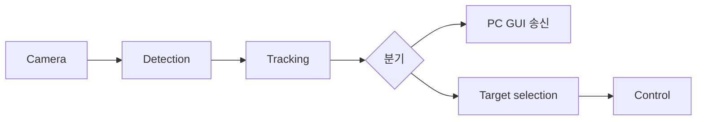

# LWIR DEEPX 표적 탐지·추적 시스템

LWIR 영상에서 객체를 탐지하고 Track ID를 부여한 뒤, 사용자가 선택한 대상을 짐벌이 따라가도록 만드는 C++ runtime입니다. 현재 기준 구성은 **YOLOv8 + ByteTrack**이며 PC용 Docker 환경에서 개발하고 있습니다.

> 현재는 파이프라인 골격을 개발하는 단계입니다. Camera, DEEPX 추론, ByteTrack, 짐벌 제어는 아직 실제 장치와 연결되지 않았습니다. 지금 실행하면 thread의 시작과 정상 종료 흐름을 확인할 수 있습니다.

## 빠른 시작

모든 명령은 저장소 루트에서 실행합니다. Windows에서는 PowerShell이 아니라 **WSL 2 Ubuntu 터미널**을 사용하고 Docker Desktop의 WSL 연동을 켜야 합니다.

### 1. 프로젝트 이미지 만들기

최초 한 번만 실행합니다.

```bash
docker build -t lwir-runtime-pc:dxas-5749ab70-ubuntu22.04 -f docker/runtime-pc/Dockerfile .
```

이 명령은 DEEPX 기반 이미지 `dx-runtime:dxas-5749ab70-ubuntu22.04`가 PC에 있어야 동작합니다. 기반 이미지가 없다면 아래의 [DEEPX 기반 이미지 준비](#deepx-기반-이미지-준비)를 먼저 진행합니다.

### 2. 빌드하기

```bash
docker compose run --rm runtime-pc -lc 'cmake -S . -B build && cmake --build build -j'
```

### 3. 실행하기

```bash
docker compose run --rm runtime-pc -lc './build/lwir_runtime'
```

코드를 수정한 뒤에는 아래 명령 하나로 다시 빌드하고 실행할 수 있습니다.

```bash
docker compose run --rm runtime-pc -lc 'cmake --build build -j && ./build/lwir_runtime'
```

테스트는 다음 명령으로 실행합니다.

```bash
docker compose run --rm runtime-pc -lc 'ctest --test-dir build --output-on-failure'
```

컨테이너 안에서 여러 명령을 직접 실행하려면 셸을 엽니다.

```bash
docker compose run --rm runtime-pc
```

빌드 결과는 Docker 볼륨 `runtime-build`에 유지되므로 컨테이너를 종료할 때마다 처음부터 빌드하지 않습니다. C++ 코드나 YAML만 수정했다면 Docker 이미지를 다시 만들 필요도 없습니다. `docker/runtime-pc/Dockerfile`이나 설치 패키지를 바꾼 경우에만 1단계를 다시 실행합니다.

## 설정 변경

기본 실행 설정은 [config/runtime.yaml](config/runtime.yaml)입니다.

| 파일 | 용도 |
|---|---|
| [config/runtime.yaml](config/runtime.yaml) | 로그, detector, backend, tracking, control, 측정 모드 |
| [config/model/yolov8n.yaml](config/model/yolov8n.yaml) | 모델 경로, 입력 크기, 전·후처리 값 |
| [config/tracking/bytetrack.yaml](config/tracking/bytetrack.yaml) | ByteTrack 설정 |
| [config/control.yaml](config/control.yaml) | 짐벌 제어 설정 |

개인 경로나 실험값은 공용 YAML을 직접 바꾸지 말고 Git에서 제외되는 `config/local/`에 복사해 사용합니다.

```bash
mkdir -p config/local
cp config/runtime.yaml config/local/runtime.yaml
docker compose run --rm runtime-pc -lc './build/lwir_runtime config/local/runtime.yaml'
```

모델·추적·제어 YAML도 개인별로 바꿔야 한다면 `config/local/`에 함께 복사하고, 복사한 `runtime.yaml`의 경로를 수정합니다. 컴파일된 `.dxnn` 모델은 `models/`에 두며 이 디렉터리는 Git에 포함되지 않습니다.

### 성능 측정

`config/runtime.yaml`에서 다음 값을 바꾸면 단계별 대기 시간과 처리 시간을 기록합니다.

```yaml
measurement:
  enabled: true
```

결과는 실행 종료 후 `results/<모델명>_<시각>/metrics.csv`에 저장됩니다. 실행에 사용한 YAML 사본도 같은 결과 디렉터리에 남습니다. 현재 짐벌이 연결되지 않았으므로 `control.enabled`는 `false`로 유지합니다.

## 파이프라인


```mermaid
flowchart LR
    Camera --> Detection --> Tracking --> Fork{분기}
    Fork --> GUI[PC GUI 송신]
    Fork --> TargetSelection[Target selection] --> Control
```

각 단계는 별도 POSIX thread로 실행되며 `ThreadSafeQueue`로 데이터를 전달합니다. DX-AllSuite의 detection runner 구조에 맞춰 전처리, NPU 추론, 후처리는 하나의 `Detection` 컴포넌트 안에서 수행합니다.

| 단계 | 입력 → 출력 |
|---|---|
| Camera | 카메라 → `shared_ptr<const FrameContext>` |
| Detection | `FrameContext` → `DetectionResult` |
| Tracking | `DetectionResult` → `TrackingResult` |
| GUI 송신 | `TrackingResult` → 압축 프레임과 Track 목록 |
| Target selection | `TrackingResult` → `TargetSelection` |
| Control | `TargetSelection` → 짐벌 명령 |

원본 영상은 `FrameContext` 하나만 만들고 `shared_ptr`로 Detection, Tracking, GUI 경로까지 공유합니다. Tracking 결과도 GUI와 제어 경로가 같은 객체를 공유합니다. GUI queue는 지연 누적을 막기 위해 최신 결과 두 개만 유지합니다.

[Application](src/app/application.cpp)이 구성요소와 thread를 연결합니다. 전체 GUI 흐름은 [파이프라인 문서](docs/pipeline.html), 편집 가능한 원본은 [draw.io 파일](docs/orange_pi_pc_gui_pipeline_clean.drawio), 아직 합의가 필요한 항목은 [discussion.md](discussion.md)를 참고합니다.

## 현재 구현 상태

- `shared_ptr<FrameContext>`가 Detection과 Tracking을 거쳐 GUI/제어 경로에 전달됩니다.
- 전처리·추론·후처리를 소유하는 통합 `DeepxYoloV8Detector` 경계가 구현되어 있습니다.
- Tracking 결과를 GUI와 대상 선택 경로로 분기하고, GUI queue는 최신 두 결과만 유지합니다.
- 프레임 ID 전달, 대상 선택, 측정 결과 저장 구조가 구현되어 있습니다.
- Camera는 아직 실제 영상을 읽지 않고 `open()`에서 종료됩니다.
- DEEPX 모델 로드·NPU 실행, 실제 ByteTrack 로직, Orange Pi 짐벌 제어는 TODO 상태입니다.
- 네트워크 전송과 PC GUI는 아직 구현되지 않았으며 `Application::pop_gui_result()`가 송신 worker 연결 경계입니다.
- CMake는 아직 DX-RT를 링크하지 않으며 Compose에도 NPU 장치 전달 설정이 없습니다.
- `ctest`에서 대상 선택과 shared frame 분기 구조를 검사합니다.

## 개발 규칙

`main`에 직접 commit하지 않고 컴포넌트별 작업 브랜치를 만들어 PR로 반영합니다.

```bash
git switch main
git pull origin main
git switch -c feature/camera-input
```

작업이 끝나면 변경한 파일만 commit하고 현재 브랜치를 push합니다.

```bash
git push -u origin HEAD
```

- 한 브랜치에는 한 가지 목적의 변경만 담습니다.
- `include/common/`, `src/pipeline/`, `CMakeLists.txt`, 공용 YAML을 바꾸면 PR에 영향 범위를 적습니다.
- 개인별 경로와 실험값은 `config/local/`에서 관리합니다.
- 다른 담당자의 컴포넌트나 공용 인터페이스를 바꿔야 한다면 먼저 담당자와 합의합니다.
- PR 전 최신 `main`은 `git fetch origin` 후 `git merge origin/main`으로 반영합니다.
- 공유 중인 브랜치에는 force push를 사용하지 않습니다.

| 컴포넌트 | 주요 작업 위치 |
|---|---|
| Camera | `include/camera/`, `src/camera/` |
| Detection | `include/detection/`, `src/detection/` |
| Tracking | `include/tracking/`, `src/tracking/`, `tests/tracking/` |
| Pipeline | `include/pipeline/`, `src/pipeline/`, `tests/pipeline/` |
| Target selection | `include/target/`, `src/target/`, `tests/target/` |
| Gimbal control | `include/control/`, `src/control/` |

## DEEPX 기반 이미지 준비

프로젝트 이미지가 사용하는 DX-AllSuite 버전은 커밋 `5749ab70cc75cede356c57b9cc7cf91229e47742`로 고정되어 있습니다. 기반 이미지가 이미 있는지는 다음 명령으로 확인합니다.

```bash
docker image inspect dx-runtime:dxas-5749ab70-ubuntu22.04
```

이미지가 없다면 runtime 저장소와 같은 상위 디렉터리에 DX-AllSuite를 받은 뒤 한 번만 빌드합니다.

```bash
cd ..
git clone https://github.com/DEEPX-AI/dx-all-suite.git
cd dx-all-suite
git checkout 5749ab70cc75cede356c57b9cc7cf91229e47742
git submodule update --init --recursive
./docker_build.sh --target=dx-runtime --ubuntu_version=22.04
docker tag dx-runtime:ubuntu-22.04 dx-runtime:dxas-5749ab70-ubuntu22.04
cd ../runtime
```

자세한 환경 준비는 [DEEPX DX-AllSuite 안내](https://github.com/DEEPX-AI/dx-all-suite/blob/main/docs/source/02_Setting_Up_Environment.md)를 참고합니다. Windows 사용자는 [WSL 설치 안내](https://learn.microsoft.com/windows/wsl/install)와 [Docker Desktop WSL 연동 안내](https://docs.docker.com/desktop/features/wsl/)도 확인하세요.
