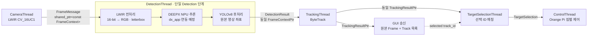

# LWIR DEEPX Tracking Runtime

LWIR 카메라 영상에서 객체를 검출하고 추적한 뒤, 같은 프레임과 Track 결과를 GUI와 짐벌 제어 경로로 전달하는 C++ 런타임입니다.

현재 기준 조합은 다음과 같습니다.

- 입력: `CV_16UC1` LWIR 영상
- Detection: YOLOv8 + DEEPX `dx_app` 구조
- Tracking: ByteTrack
- 실행 구조: POSIX pthread + thread-safe queue

## 파이프라인


```mermaid
flowchart LR
    Camera["CameraThread<br/>LWIR CV_16UC1"]

    subgraph Detection["DetectionThread · 단일 Detection 단계"]
        direction LR
        Preprocess["LWIR 전처리<br/>16-bit → RGB · letterbox"]
        Inference["DEEPX NPU 추론<br/>dx_app 연동 예정"]
        Postprocess["YOLOv8 후처리<br/>원본 영상 좌표"]
        Preprocess --> Inference --> Postprocess
    end

    Tracking["TrackingThread<br/>ByteTrack"]
    GUI["GUI 송신<br/>원본 Frame + Track 목록"]
    Selection["TargetSelectionThread<br/>선택 ID 매칭"]
    Control["ControlThread<br/>Orange Pi 짐벌 제어"]

    Camera -->|"FrameMessage<br/>shared_ptr&lt;const FrameContext&gt;"| Preprocess
    Postprocess -->|"DetectionResult<br/>동일 FrameContextPtr"| Tracking
    Tracking -->|"TrackingResultPtr"| GUI
    Tracking -->|"동일 TrackingResultPtr"| Selection
    GUI -.->|"selected track_id"| Selection
    Selection -->|"TargetSelection"| Control
```

Camera에서 만든 `FrameContext`는 복사하지 않고 `shared_ptr`로 Detection, Tracking, GUI까지 전달합니다. 따라서 GUI는 Track 결과가 생성된 정확한 원본 프레임을 사용할 수 있습니다.

Detection은 `DxAppDetectionPipeline` 한 객체가 전처리, 추론, 후처리를 소유합니다. 별도의 preprocess/inference/postprocess thread는 사용하지 않습니다.

## 빠른 시작

CPU-only 빌드와 테스트는 저장소 루트에서 한 명령으로 실행합니다.

```bash
./scripts/verify_cpu.sh
```

실행 파일은 다음과 같이 시작합니다.

```bash
./build/cpu/lwir_runtime
```

기본 설정 파일은 `config/runtime.yaml`입니다. 다른 설정을 사용하려면 경로를 전달합니다.

```bash
./build/cpu/lwir_runtime config/local/runtime.yaml
```

## Docker 사용

프로젝트 이미지를 만들고 컨테이너를 엽니다.

```bash
docker compose build runtime-pc
docker compose run --rm runtime-pc
```

컨테이너 안에서는 동일하게 검증 스크립트를 실행합니다.

```bash
./scripts/verify_cpu.sh
```

Docker 기반 이미지는 기본적으로 `dx-runtime:dxas-5749ab70-ubuntu22.04`를 사용합니다. 다른 이미지는 `.env.example`의 `DX_RUNTIME_IMAGE`를 설정해 지정할 수 있습니다.

## DEEPX dx_app 연동

공식 `DEEPX-AI/dx_app`은 `third_party/dx_app` submodule로 고정되어 있습니다.

```bash
git submodule update --init --recursive
cmake -S . -B build -DLWIR_ENABLE_DX_APP=ON
cmake --build build -j
```

외부 dx_app 체크아웃을 사용하려면 다음 옵션을 추가합니다.

```bash
cmake -S . -B build -DLWIR_ENABLE_DX_APP=ON -DDX_APP_ROOT=/path/to/dx_app
```

현재 CPU-only 빌드에서는 LWIR 전처리와 pipeline 경계만 검증합니다. DXNN 로딩, NPU 추론, tensor 검증과 성능 측정은 실제 DEEPX 장치에서 추가 검증해야 합니다. 가짜 추론 결과는 생성하지 않습니다.

## 설정

- `config/runtime.yaml`: Detection backend, Tracking, Control, 측정 설정
- `config/model/yolov8n.yaml`: LWIR 입력 범위, 모델 입력 크기, letterbox와 후처리 설정
- `config/tracking/bytetrack.yaml`: ByteTrack 설정
- `config/control.yaml`: 제어 설정

모델별 값은 `config/model/*.yaml`에 두고, YAML 파싱과 검증은 `AppConfig`에서 담당합니다. Detection 결과 좌표는 원본 LWIR 프레임 기준이어야 합니다.

## GUI 연결 경계

GUI에서 선택한 Track ID는 다음 함수로 전달합니다.

```cpp
application.set_selected_track_id(track_id);
```

GUI로 보낼 최신 프레임과 Track 결과는 다음 함수에서 가져옵니다.

```cpp
TrackingResultPtr result;
application.pop_gui_result(result);
```

`result->frame->image`와 `result->tracks`는 동일한 프레임에 대응합니다. GUI queue는 화면 지연 누적을 막기 위해 최신 결과 두 개만 유지합니다.

## 현재 구현 상태

- 구현됨: thread/queue 연결, shared Frame 수명 관리, LWIR 전처리, 설정 검증, GUI/제어 결과 분기
- 골격 상태: 실제 카메라 입력, DEEPX NPU 추론·후처리, ByteTrack 내부 로직, 짐벌 통신

전체 흐름은 `docs/pipeline.html`, 논의가 필요한 항목은 `discussion.md`에서 확인할 수 있습니다.
