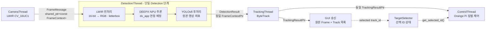

# LWIR DEEPX Tracking Runtime

LWIR 카메라 영상에서 객체를 검출하고 추적한 뒤, 같은 프레임과 Track 결과를 GUI와 짐벌 제어 경로로 전달하는 C++ 런타임입니다.

현재 기준 조합은 다음과 같습니다.

- 입력: `CV_16UC1` LWIR 영상
- Detection: YOLOv8 + DEEPX `dx_app` 구조
- Tracking: ByteTrack
- 실행 구조: POSIX pthread + thread-safe queue
- 동기화/통신: POSIX pthread mutex와 POSIX socket API

런타임에서 직접 소유하는 thread, mutex, socket은 POSIX API로 통일합니다.
`std::thread`, `std::mutex`, `std::atomic`은 사용하지 않습니다. GStreamer는 영상
pipeline 내부 구현을 위해 GLib을 사용하지만 애플리케이션 worker와 socket의
소유권은 POSIX 경계에 유지합니다.

## 파이프라인


```mermaid
flowchart LR
    Camera["CameraThread<br/>LWIR CV_16UC1"]

    subgraph Detection["DetectionThread · 단일 Detection 단계"]
        direction LR
        Preprocess["LWIR 전처리<br/>16-bit → RGB · letterbox"]
        Inference["DEEPX NPU 추론<br/>dx_app 연동 예정"]
        Postprocess["YOLOv8 후처리<br/>원본 영상 좌표"]
        Preprocess --> Inference --> Postprocess
    end

    Tracking["TrackingThread<br/>ByteTrack"]
    GUI["GUI 송신<br/>원본 Frame + Track 목록"]
    Selection["TargetSelector<br/>선택 ID 상태"]
    Control["ControlThread<br/>Orange Pi 짐벌 제어"]

    Camera -->|"FrameMessage<br/>shared_ptr&lt;const FrameContext&gt;"| Preprocess
    Postprocess -->|"DetectionResult<br/>동일 FrameContextPtr"| Tracking
    Tracking -->|"TrackingResultPtr"| GUI
    Tracking -->|"동일 TrackingResultPtr"| Control
    GUI -.->|"selected track_id"| Selection
    Selection -.->|"get_selected_id()"| Control
```

Camera에서 만든 `FrameContext`는 복사하지 않고 `shared_ptr`로 Detection, Tracking, GUI까지 전달합니다. 따라서 GUI는 Track 결과가 생성된 정확한 원본 프레임을 사용할 수 있습니다.

Detection은 `DxAppDetectionPipeline` 한 객체가 전처리, 추론, 후처리를 소유합니다. 별도의 preprocess/inference/postprocess thread는 사용하지 않습니다.

## 빠른 시작

CPU-only 빌드와 테스트는 저장소 루트에서 한 명령으로 실행합니다.

```bash
./scripts/verify_cpu.sh
```

실행 파일은 다음과 같이 시작합니다.

```bash
./build/cpu/lwir_runtime
```

기본 설정 파일은 `config/runtime.yaml`입니다. 다른 설정을 사용하려면 경로를 전달합니다.

```bash
./build/cpu/lwir_runtime config/local/runtime.yaml
```

## Docker 사용

프로젝트 이미지를 만들고 컨테이너를 엽니다.

```bash
docker compose build runtime-pc
docker compose run --rm runtime-pc
```

컨테이너 안에서는 동일하게 검증 스크립트를 실행합니다.

```bash
./scripts/verify_cpu.sh
```

Docker 기반 이미지는 기본적으로 `dx-runtime:dxas-5749ab70-ubuntu22.04`를 사용합니다. 다른 이미지는 `.env.example`의 `DX_RUNTIME_IMAGE`를 설정해 지정할 수 있습니다.

## DEEPX dx_app 연동

공식 `DEEPX-AI/dx_app`은 `third_party/dx_app` submodule로 고정되어 있습니다.

```bash
git submodule update --init --recursive
cmake -S . -B build -DLWIR_ENABLE_DX_APP=ON
cmake --build build -j
```

외부 dx_app 체크아웃을 사용하려면 다음 옵션을 추가합니다.

```bash
cmake -S . -B build -DLWIR_ENABLE_DX_APP=ON -DDX_APP_ROOT=/path/to/dx_app
```

현재 CPU-only 빌드에서는 LWIR 전처리와 pipeline 경계만 검증합니다. DXNN 로딩, NPU 추론, tensor 검증과 성능 측정은 실제 DEEPX 장치에서 추가 검증해야 합니다. 가짜 추론 결과는 생성하지 않습니다.

## i3system 카메라 연동

Orange Pi에서 `/usr/local/include/i3system`과 `/usr/local/lib`에 설치된 Thermal
Expert SDK를 사용하려면 카메라 옵션을 활성화합니다.

```bash
cmake -S . -B build/orangepi \
    -DLWIR_ENABLE_I3_CAMERA=ON \
    -DI3SYSTEM_ROOT=/usr/local \
    -DLWIR_ENABLE_DX_APP=ON
cmake --build build/orangepi -j
```

SDK를 다른 위치에 설치했다면 `I3SYSTEM_ROOT`를 해당 설치 루트로 지정합니다.
CPU-only 빌드는 기본값인 `LWIR_ENABLE_I3_CAMERA=OFF`를 사용하며 실제 프레임을
생성하지 않습니다.

카메라가 연결된 Orange Pi에서는 실제 프레임이 CameraThread queue까지 들어오는지
하드웨어 테스트를 실행할 수 있습니다.

```bash
ctest --test-dir build/orangepi -R camera_capture --output-on-failure
```

이 테스트는 `CV_16UC1`, 640x480, 연속 메모리, 최초 frame ID와 capture timestamp를
검증하며 실제 카메라가 없으면 실패합니다.

## 설정

- `config/runtime.yaml`: Detection, ByteTrack, Control, GUI, 측정 설정
- `config/model/yolov8n.yaml`: LWIR 입력 범위, 모델 입력 크기, letterbox와 후처리 설정

모델별 값만 `config/model/*.yaml`에 분리하고 나머지 실행 설정은
`config/runtime.yaml`에서 관리합니다. YAML 파싱과 검증은 모두 `AppConfig`가
담당하며 각 처리 컴포넌트는 검증된 typed config만 전달받습니다. Detection 결과
좌표는 원본 LWIR 프레임 기준이어야 합니다.

GUI 설정도 `config/runtime.yaml`의 `gui` 항목에서 관리합니다.

- `gui.video`: bbox가 그려지지 않은 H.264/RTP/UDP 영상
- `gui.metadata`: `frame_id`, Track ID와 원본 좌표 bbox를 보내는 별도 UDP 채널
- `gui.command`: GUI가 선택한 Track ID를 받는 TCP 채널

GUI 컴포넌트는 YAML을 직접 읽지 않고 `AppConfig::gui`로 전달된 검증 완료
설정만 사용합니다.

현재 송신 구현은 GStreamer `x264enc` 소프트웨어 encoder를 사용합니다. GUI
장치의 IP는 `gui.video.host`, 영상 UDP 포트는 `gui.video.port`, Orange Pi의
metadata UDP 포트는 `gui.metadata.port`, 명령 TCP listen 포트는
`gui.command.port`에서 변경합니다. Orange Pi 전용 하드웨어 H.264 encoder는
장치의 GStreamer plugin을 확인한 뒤 추가해야 합니다.

## 현재 구현 상태

- 구현됨: thread/queue 연결, shared Frame 수명 관리, LWIR 전처리, 설정 검증,
  ByteTrack, GUI/제어 결과 분기
- 구현됨: GStreamer `x264enc` 기반 H.264/RTP/UDP 영상 송신, 별도 Track
  metadata UDP 송신, GUI TCP 명령 수신·재접속·종료 처리
- 구현됨(하드웨어 미검증): i3system Thermal Expert SDK 카메라 입력
- 골격 상태: DEEPX NPU 추론·후처리, Orange Pi 하드웨어 H.264 encoder,
  짐벌 통신

전체 흐름은 `docs/pipeline.html`, 논의가 필요한 항목은 `discussion.md`에서 확인할 수 있습니다.

## 테스트 실행

테스트를 포함해 빌드하려면 `BUILD_TESTING=ON`으로 설정합니다.

```bash
cmake -S . -B build/test \
    -DBUILD_TESTING=ON \
    -DLWIR_ENABLE_I3_CAMERA=OFF \
    -DLWIR_ENABLE_DX_APP=OFF

cmake --build build/test -j
```

등록된 테스트 목록은 다음 명령으로 확인합니다.

```bash
ctest --test-dir build/test -N
```

전체 테스트를 실행합니다.

```bash
ctest --test-dir build/test --output-on-failure
```

특정 영역의 테스트만 실행할 수도 있습니다.

```bash
# ByteTrack 테스트
ctest --test-dir build/test -R bytetrack --output-on-failure

# Detection 테스트
ctest --test-dir build/test -R detection --output-on-failure

# LWIR 전처리 테스트
ctest --test-dir build/test -R lwir_preprocessor --output-on-failure

# Target Selector 테스트
ctest --test-dir build/test -R target_selector --output-on-failure

# Shared Frame 파이프라인 테스트
ctest --test-dir build/test -R shared_frame_pipeline --output-on-failure
```

테스트가 필요하지 않은 일반 빌드에서는 다음과 같이 비활성화할 수 있습니다.

```bash
cmake -S . -B build/cpu \
    -DBUILD_TESTING=OFF \
    -DLWIR_ENABLE_I3_CAMERA=OFF \
    -DLWIR_ENABLE_DX_APP=OFF

cmake --build build/cpu -j
```
